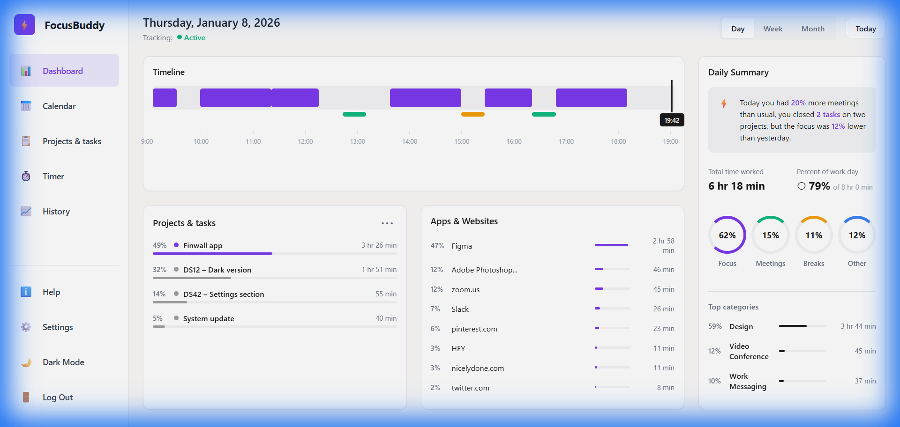

# FocusBuddy

Full-stack productivity app with focus sessions, streak tracking, and real-time squad status. Spring Boot backend + React Native (Expo) frontend.

## Tech Stack

| Layer     | Tech                                      |
|-----------|-------------------------------------------|
| Backend   | Java 17, Spring Boot 3.2, JPA, H2/PostgreSQL |
| Frontend  | React Native 0.81, Expo 54, Axios         |
| Auth      | JWT (HS512), BCrypt                       |
| Real-time | WebSocket (STOMP/SockJS)                  |

## Run Locally

### Prerequisites

- Java 17+
- Node.js 18+

### Backend

```bash
cd server

# Windows
.\mvnw.cmd spring-boot:run

# macOS/Linux
./mvnw spring-boot:run
```

API runs at `http://localhost:8080`

### Frontend

```bash
cd client
npm install
npm start
```

Press `w` for web, `a` for Android, `i` for iOS.

## Screenshots

<!-- Add screenshots here -->
| Light Mode | Dark Mode |
|------------|-----------|
|  |  |

## Project Structure

```
FocusBuddy/
├── client/          # React Native app
│   └── src/
│       ├── components/
│       ├── screens/
│       └── services/
└── server/          # Spring Boot API
    └── src/main/java/com/focusbuddy/
        ├── controller/
        ├── service/
        ├── model/
        └── security/
```

## API Endpoints

| Method | Endpoint                      | Description         |
|--------|-------------------------------|---------------------|
| POST   | `/api/auth/signup`            | Register user       |
| POST   | `/api/auth/login`             | Get JWT token       |
| POST   | `/api/sessions/start`         | Start focus session |
| POST   | `/api/sessions/{id}/complete` | Complete session    |
| GET    | `/api/sessions/history`       | Session history     |

> All `/api/sessions/*` endpoints require `Authorization: Bearer <token>`

## License

MIT
