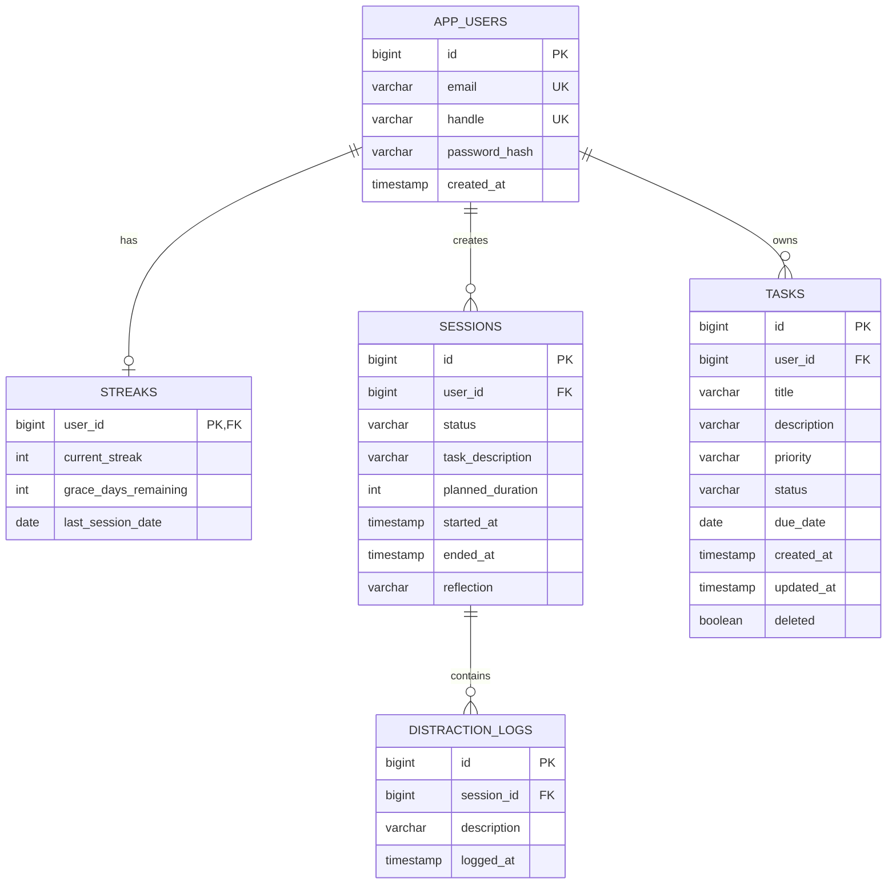

# FocusBuddy Database Schema

This document describes the database schema for the FocusBuddy application.

## Entity Relationship Diagram



---

## Table Definitions

### `app_users`
User accounts with authentication credentials.

| Column | Type | Constraints | Description |
|--------|------|-------------|-------------|
| `id` | BIGINT | PK, AUTO | Unique identifier |
| `email` | VARCHAR(255) | UNIQUE, NOT NULL | Login email |
| `handle` | VARCHAR(20) | UNIQUE, NOT NULL | Display username |
| `password_hash` | VARCHAR(255) | NOT NULL | BCrypt hashed password |
| `created_at` | TIMESTAMP | | Account creation time |

---

### `streaks`
Tracks user's consecutive daily focus sessions.

| Column | Type | Constraints | Description |
|--------|------|-------------|-------------|
| `user_id` | BIGINT | PK, FK | References `app_users.id` |
| `current_streak` | INT | DEFAULT 0 | Current streak count |
| `grace_days_remaining` | INT | DEFAULT 1 | Allowed missed days |
| `last_session_date` | DATE | | Date of last completed session |

**Streak Decay Algorithm**: If no session for 2+ days and no grace days remaining:
```
NewStreak = CurrentStreak - floor(CurrentStreak * 0.20)
```

---

### `sessions`
Focus sessions (Pomodoro-style work intervals).

| Column | Type | Constraints | Description |
|--------|------|-------------|-------------|
| `id` | BIGINT | PK, AUTO | Unique identifier |
| `user_id` | BIGINT | FK, NOT NULL | References `app_users.id` |
| `status` | VARCHAR(15) | NOT NULL | ACTIVE, COMPLETED, ABANDONED |
| `task_description` | VARCHAR(60) | NOT NULL | What user is working on |
| `planned_duration` | INT | NOT NULL | Duration in minutes (25, 45, 60) |
| `started_at` | TIMESTAMP | | Session start time |
| `ended_at` | TIMESTAMP | | Session end time |
| `reflection` | TEXT | | Optional completion notes |

---

### `distraction_logs`
Distractions logged during active sessions.

| Column | Type | Constraints | Description |
|--------|------|-------------|-------------|
| `id` | BIGINT | PK, AUTO | Unique identifier |
| `session_id` | BIGINT | FK, NOT NULL | References `sessions.id` |
| `description` | VARCHAR(255) | | What distracted the user |
| `logged_at` | TIMESTAMP | | When distraction occurred |

---

### `tasks`
User's to-do items (independent of focus sessions).

| Column | Type | Constraints | Description |
|--------|------|-------------|-------------|
| `id` | BIGINT | PK, AUTO | Unique identifier |
| `user_id` | BIGINT | FK, NOT NULL | References `app_users.id` |
| `title` | VARCHAR(100) | NOT NULL | Task title |
| `description` | VARCHAR(500) | | Detailed description |
| `priority` | VARCHAR(10) | NOT NULL | LOW, MEDIUM, HIGH |
| `status` | VARCHAR(15) | NOT NULL | TODO, IN_PROGRESS, COMPLETED |
| `due_date` | DATE | | Optional deadline |
| `created_at` | TIMESTAMP | NOT NULL | Creation time |
| `updated_at` | TIMESTAMP | | Last modification time |
| `deleted` | BOOLEAN | DEFAULT FALSE | Soft delete flag |

**Indexes**:
- `idx_task_user_id` on `user_id`
- `idx_task_status` on `status`
- `idx_task_due_date` on `due_date`

---

## PostgreSQL DDL

```sql
-- Users table
CREATE TABLE app_users (
    id BIGSERIAL PRIMARY KEY,
    email VARCHAR(255) UNIQUE NOT NULL,
    handle VARCHAR(20) UNIQUE NOT NULL,
    password_hash VARCHAR(255) NOT NULL,
    created_at TIMESTAMP DEFAULT CURRENT_TIMESTAMP
);

-- Streaks table (1:1 with users)
CREATE TABLE streaks (
    user_id BIGINT PRIMARY KEY REFERENCES app_users(id) ON DELETE CASCADE,
    current_streak INT DEFAULT 0,
    grace_days_remaining INT DEFAULT 1,
    last_session_date DATE
);

-- Sessions table
CREATE TABLE sessions (
    id BIGSERIAL PRIMARY KEY,
    user_id BIGINT NOT NULL REFERENCES app_users(id) ON DELETE CASCADE,
    status VARCHAR(15) NOT NULL,
    task_description VARCHAR(60) NOT NULL,
    planned_duration INT NOT NULL,
    started_at TIMESTAMP,
    ended_at TIMESTAMP,
    reflection TEXT
);

CREATE INDEX idx_session_user_id ON sessions(user_id);
CREATE INDEX idx_session_status ON sessions(status);

-- Distraction logs table
CREATE TABLE distraction_logs (
    id BIGSERIAL PRIMARY KEY,
    session_id BIGINT NOT NULL REFERENCES sessions(id) ON DELETE CASCADE,
    description VARCHAR(255),
    logged_at TIMESTAMP DEFAULT CURRENT_TIMESTAMP
);

-- Tasks table
CREATE TABLE tasks (
    id BIGSERIAL PRIMARY KEY,
    user_id BIGINT NOT NULL REFERENCES app_users(id) ON DELETE CASCADE,
    title VARCHAR(100) NOT NULL,
    description VARCHAR(500),
    priority VARCHAR(10) NOT NULL DEFAULT 'MEDIUM',
    status VARCHAR(15) NOT NULL DEFAULT 'TODO',
    due_date DATE,
    created_at TIMESTAMP NOT NULL DEFAULT CURRENT_TIMESTAMP,
    updated_at TIMESTAMP DEFAULT CURRENT_TIMESTAMP,
    deleted BOOLEAN DEFAULT FALSE
);

CREATE INDEX idx_task_user_id ON tasks(user_id);
CREATE INDEX idx_task_status ON tasks(status);
CREATE INDEX idx_task_due_date ON tasks(due_date);
```
